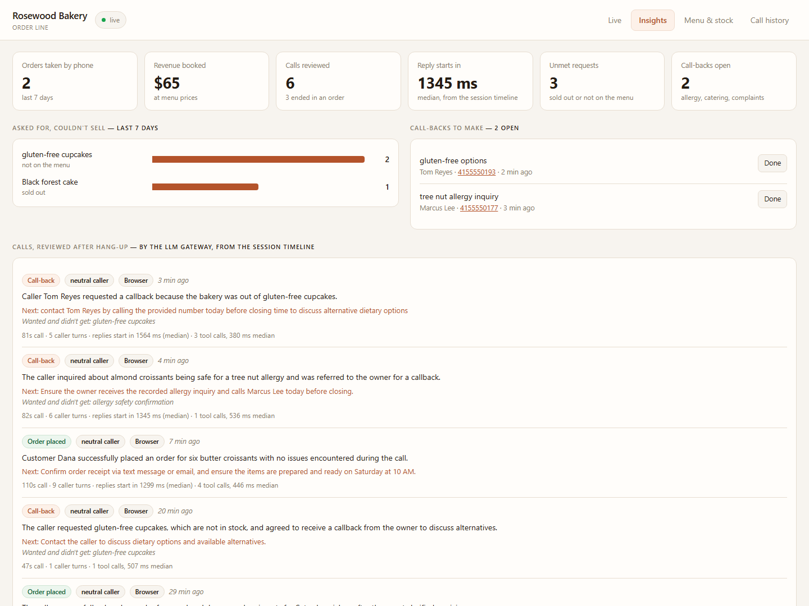
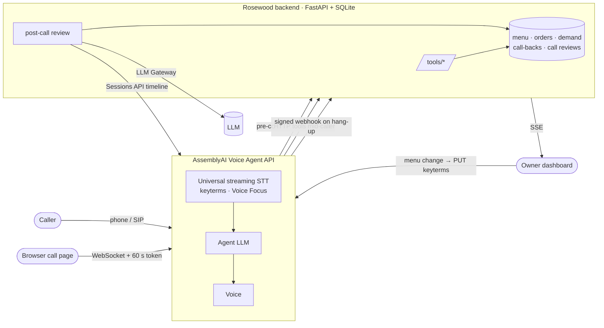

# Rosewood — the phone line a small bakery never has to answer

**An AI voice agent that takes custom cake orders over the phone, knows the regulars by name, hands allergy questions to a human, and tells the owner what customers wanted and couldn't buy.** Built on the [AssemblyAI Voice Agent API](https://www.assemblyai.com/products/voice-agent-api).

<!-- Replace with your hosted URL, phone number and video link before submitting. -->
**Try it:** [live dashboard](https://YOUR-SERVICE.onrender.com) · call **+1 (XXX) XXX-XXXX** · [2-minute demo video](https://youtu.be/XXXX)


<sub>Insights tab after six simulated test calls: the reviews, reply latency, missed demand and call-backs are all real.</sub>

---

## The problem

Independent food shops lose orders on the phone during their busiest hours, when both hands are in the dough.

- About **62% of calls to small businesses go unanswered**, and most callers who reach nobody don't call back; many ring a competitor instead.<sup>[1](#sources)</sup>
- A custom-cake order is worth $40–$100. A voicemail doesn't take one.
- Even answered calls lose information: nobody writes down "third person this week asking for gluten-free".

## What Rosewood does

**For the caller** it's a warm, brisk shop assistant:

| | |
| --- | --- |
| **Takes real orders** | Checks live stock and price before agreeing to anything, offers an alternative when something is sold out, takes cake size and inscription, finds a pickup slot that has baking capacity, reads the order back, and gives a four-digit order number. |
| **Knows the regulars** | On the phone, the caller's number is looked up *before the call is answered*: "Rosewood Bakery, hi Dana. Is it the butter croissant again?" In the browser, it asks for the number first, the way a pizza shop does. |
| **Knows its limits** | Allergy and dietary questions, complaints and catering go to the owner as a call-back with a written reason. It never guesses. "Gluten-free cupcakes" is never fuzzy-matched to the ordinary cupcakes. |
| **Checks orders** | "Is my cake ready?" reads the live status off the kitchen board. |

**For the owner** it's a dashboard that fills itself in:

| | |
| --- | --- |
| **Live board** | Orders land in *New* seconds after the caller says yes. *Baking → Ready → Collected* is one tap each. |
| **Signals** | While a call is happening: "Caller asked for *black forest cake*, sold out." |
| **Missed demand** | Every sold-out or off-menu request, ranked. What to bake more of, and what to add. |
| **Call-backs** | Who to phone, their number, and why. |
| **Call reviews** | About a minute after every hang-up: outcome, caller sentiment, a one-line summary, the next action, and how fast the agent replied. |
| **Menu that teaches the ear** | Add "pain au chocolat" on the dashboard and it's pushed to the agent's speech recognition as a keyterm, so it's heard correctly on the next call. |

## How it uses AssemblyAI

| Capability | Where | Why it matters here |
| --- | --- | --- |
| [Voice Agent API](https://www.assemblyai.com/docs/voice-agents/voice-agent-api), one agent over browser and phone | [agents/bakery.jsonc](agents/bakery.jsonc) | One agent definition serves the web demo and a real phone number unchanged. |
| [HTTP tools](https://www.assemblyai.com/docs/voice-agents/voice-agent-api/tools/http-tools), six of them, `hold` mode, JSON-Schema `examples` and `pattern` hints | [backend/app.py](backend/app.py) `/tools/*` | AssemblyAI calls the backend mid-sentence, so the caller hears real stock, prices and slots. |
| [Pre-connect requests](https://www.assemblyai.com/docs/voice-agents/voice-agent-api/pre-connect-requests) | `/voice/pre_connect` | Regulars are greeted by name with their usual before they say a word. Fails open inside the 800 ms budget. |
| [Keyterms](https://www.assemblyai.com/docs/voice-agents/voice-agent-api/transcription-prompt), **kept in sync with the live menu** | `sync_keyterms()` | "Tres leches" and "pain au chocolat" are transcribed as menu items, not homophones. A wrong flavour is a wrong cake. |
| [Transcription prompt](https://www.assemblyai.com/docs/voice-agents/voice-agent-api/transcription-prompt) | agent `input` | Primes speech-to-text for kilograms, phone numbers, order numbers and pickup times. |
| [Voice Focus](https://www.assemblyai.com/docs/voice-agents/voice-agent-api/noise-suppression) | agent `input` | Oven fans and a queue at the counter don't become words or false interruptions. |
| [Webhooks](https://www.assemblyai.com/docs/voice-agents/voice-agent-api/webhooks), signed with HMAC and deduplicated | `/webhooks/assemblyai`, [setup_webhook.py](setup_webhook.py) | Every finished call, from browser or phone, triggers a review without polling. |
| [Sessions API](https://www.assemblyai.com/docs/voice-agents/voice-agent-api/session-history): recordings and timelines | Call history tab | Replay any call with its transcript, each tool call and its result, and per-turn reply latency. |
| [LLM Gateway](https://www.assemblyai.com/docs/llm-gateway/quickstart), structured output with a `json-repair` fallback | `_summarise()` | Turns a timeline into outcome, sentiment, summary, follow-up and unmet requests. |
| [Temporary tokens](https://www.assemblyai.com/docs/voice-agents/voice-agent-api/browser-integration) | `/api/token` | The API key never reaches the browser. |
| [Twilio SIP](https://www.assemblyai.com/docs/voice-agents/voice-agent-api/connect-to-twilio) | [deployment/telephony](deployment/telephony/) | A real number to call, with nothing of ours in the audio path. |

## Architecture



## Run it

Python 3.9+. The root scripts use only the standard library; the backend is FastAPI.

```sh
cp .env.example .env                       # ASSEMBLYAI_API_KEY, TOOL_API_KEY=<any secret>, SHOP_TZ

cd backend
python -m venv .venv
.venv/Scripts/python -m pip install -r requirements.txt     # Windows (.venv/bin/python elsewhere)
.venv/Scripts/python seed_demo.py                           # optional: sample regulars, demand, call-backs
.venv/Scripts/python -m uvicorn app:app --port 8000

# AssemblyAI calls the tools from its servers, so expose the backend over HTTPS
cloudflared tunnel --url http://localhost:8000              # put the https URL in .env as BACKEND_URL

cd ..
AGENT=bakery python publish.py                              # creates or updates the agent
python setup_webhook.py                                     # call reviews after every hang-up
```

Open http://localhost:8000 and press **Start call**. Try:

- *"Two kilos of red velvet for tomorrow at four, write Happy Birthday Mira."*
- *"Do you have black forest?"* It's sold out; watch the Signals panel.
- *"Are your cupcakes gluten free?"* That goes on the owner's call-back list.
- Give **415 555 0142** as your number to be greeted as Dana, a seeded regular.

For a phone number, see [deployment/telephony](deployment/telephony/): `python deployment/telephony/connect.py`.

### Deploy

[render.yaml](render.yaml) runs the backend on Render. Set `ASSEMBLYAI_API_KEY`, `AGENT_ID` and `AAI_WEBHOOK_SECRET`, then publish the agent with `BACKEND_URL` set to the service URL. Use a paid instance for anything judged: the free tier sleeps, and a tool call into a sleeping service times out while the caller waits.

### Test

```sh
cd backend && .venv/Scripts/python -m pytest -q
```

23 tests, no network access: every tool, spoken-time parsing, the dietary guard, regular recognition from E.164 numbers, the guards that stop a model placing an order for a customer it never looked up, webhook signature checks and deduplication, the post-call review, and keyterm sync.

End to end, [scripts/sim_call.py](scripts/sim_call.py) phones the live agent with synthetic callers: a new customer who wants a sold-out cake, a returning regular, a nut-allergy question and a gluten-free request. These calls found the agent inventing a returning customer and placing an order without a yes, which is why `create_order` now refuses any number that was never looked up.

## Cost

Voice Agent API list price is **$4.50 per hour**, about 7.5¢ a minute, and includes speech-to-text, the agent LLM, voices and recordings.<sup>[2](#sources)</sup> A two-minute cake order costs about **15¢** to take. The cake is $40–$100.

## Project layout

```
agents/bakery.jsonc      the agent: prompt, voice, keyterms, pre-connect lookup, six tools
backend/app.py           tools, pre-connect, webhook + post-call review, dashboard API
backend/db.py            SQLite: menu, orders, demand, call-backs, call reviews
backend/static/          the owner dashboard and the in-browser call page
backend/test_app.py      the test suite
setup_webhook.py         subscribes the backend to session and call events
publish.py, lib.py       AssemblyAI's starter: publish agents/*.jsonc to the API
```

The same shape fits any small shop that takes orders by phone, such as a pharmacy, a tailor or a florist: swap the menu, the keyterms and the shop facts.

Built on AssemblyAI's [voice-agent-starter-python](https://github.com/AssemblyAI/voice-agent-starter-python) ([original README](docs/STARTER.md)).

## Sources

1. 411 Locals, 2024 study of 85 businesses across 58 industries: 37.8% of calls answered by a person. Summarised in [SchedulingKit's missed-call statistics](https://schedulingkit.com/statistics/missed-call-statistics).
2. [AssemblyAI pricing](https://www.assemblyai.com/pricing), Voice Agent API.
